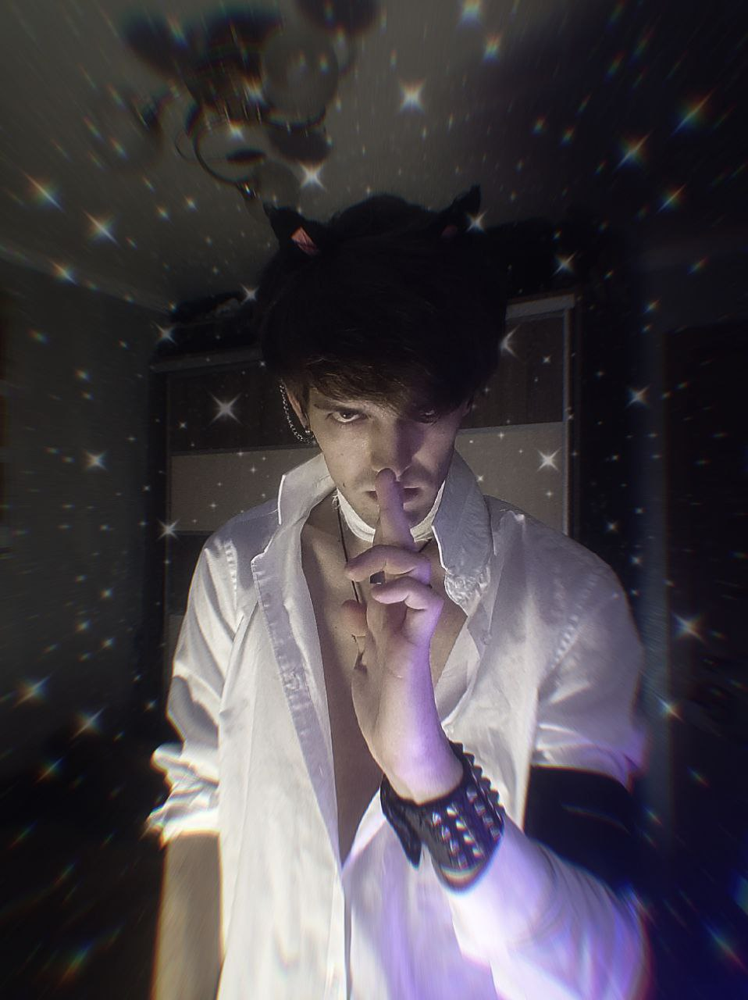

<p align="left">
  
</p>

### About me:
* Country: Ukraine.
* Age: 25 years.
* Main programming language: Python.
* Hobby: Program bots, Photoshop.
* Description:
```
I am familiar with Photoshop at the professional level, I have been doing Photoshop since
I was 12 years old, I have been programming bots since 2018. I am fully familiar with the 
VK documentation, also with the documentation Telegram and Discord by 50%.
I love to play games. My favorite genre is Fantasy
```

### My projects:

| Genshin    |  Description |   | HonkaiStarRaill    |  Description   |
|-------------|---------|-------|-------------|---------|
[EnkaCard](https://github.com/DEViantUA/EnkaCard) | Generating Character Cards | | [StarRaillCard](https://github.com/DEViantUA/StarRailCard) | Generating Character Cards |
[EnCard](https://github.com/DEViantUA/ENCard) | Addon to EnkaCard | | [HSRCard](https://github.com/DEViantUA/HSRCard) | Addon to StarRaillCard |  
[GenshinPyRail](https://github.com/DEViantUA/GenshinPyRail) | Generating images for Genshin and Honkai Star Rail | | [StarRailCardUA](https://github.com/DEViantUA/StarRailCardUA) | Translation of StarRailCard into Ukrainian
